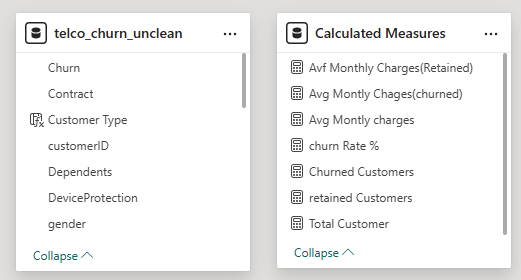
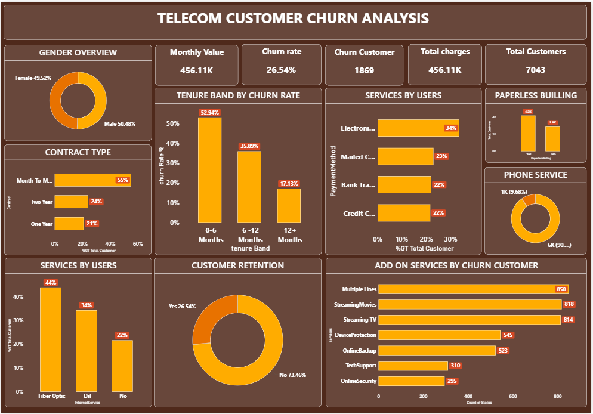

🔥 Telecom Customer Churn Analysis & Prediction
---

## 🎯 Project Overview  
Customer churn is a critical business problem that directly impacts revenue and customer retention. This project analyzes customer behavior and builds predictive models to identify customers at risk of churn, enabling proactive retention strategies.

---

## 📌 Business Problem
- High customer churn leads to revenue loss
- Analyze customer behavior across tenure, services, and billing methods  
- Difficult to identify at-risk customers early
- Need data-driven insights for retention strategies and reduce churn 
- Compare churned vs retained customers  

---
## 📂 Dataset
- **Dataset Name:** Telecom Customer Churn Dataset  
- **Records:** ~7,000 customers  
- **Columns:** 21  
- **Source:** Kaggle  
- **Attributes:** Customer demographics, tenure, contract type, payment methods, internet services, and churn status  

---

📌 *Refer to the data model diagram below:*  

## 🛠️ Tools & Technologies
- Power BI  
- Power Query  
- DAX (Data Analysis Expressions)  
- Excel / CSV  

---

## 📁 Project Structure

telecom-customer-churn-analysis/

│  
├── Telecom_Customer_Churn_Analysis.csv   
├── README.md  
│  
├── dashboard/  
│└── Telecom_Churn_Dashboard.pbix  
│  
└── images/  
├── dashboard.png  
└── data_model.png  

## 🧹 Data Preparation
Performed data cleaning and transformation to ensure high-quality analysis:

- Removed duplicate customer records  
- Handled missing values in `TotalCharges`  
- Converted data types (tenure, charges, churn)  
- Trimmed and standardized categorical fields  
- Created calculated columns:
  - Tenure Band (0–6, 6–12, 12+ months)  
- Created DAX measures:
  - Total Customers  
  - Churned Customers  
  - Churn Rate (%)  
  - Avg Monthly Charges (Churned vs Retained)  

- Transformed service columns using **Unpivoting** for service-level churn analysis  

---

## 📊 Dashboard & Visuals

The Power BI dashboard provides a comprehensive view of churn behavior:

### 🔹 KPI Metrics
- Total Customers: **7043**  
- Churned Customers: **1869**  
- Churn Rate: **26.54%**  
- Monthly Charges: **456.11K**  

### 🔹 Visual Insights
- **Gender Overview:** Nearly equal distribution (Male vs Female)  
- **Contract Type:** Month-to-month contracts dominate churn  
- **Tenure Analysis:** Highest churn in early tenure (0–6 months)  
- **Payment Method:** Electronic check users show higher churn  
- **Internet Services:** Fiber optic users churn more than DSL users  
- **Add-On Services:** Customers lacking support services churn more  
- **Customer Retention:** Majority retained (~73%), but churn is significant (~26%)  

---

## 🔍 Key Findings
- Customers with **month-to-month contracts** have the highest churn (~55%)  
- **Short-tenure customers (0–6 months)** show the highest churn (~53%)  
- Customers using **electronic check payments** are more likely to churn  
- **Fiber optic users** churn more compared to DSL users  
- Customers without **tech support and online security** are more likely to leave  
- Churn rate overall is **~26.5%**, indicating significant retention opportunity  

---

## 💡 Recommendations
- Encourage **long-term contracts** through discounts and incentives  
- Promote **auto-pay and digital payment methods**  
- Improve **fiber optic service quality and customer experience**  
- Offer **bundled services (Tech Support, Security)** to increase stickiness  
- Focus retention campaigns on **new customers (0–6 months tenure)**  

---

## 📈 Business Impact
This analysis helps organizations to:

- Identify **high-risk churn segments early**  
- Design **targeted retention strategies**  
- Improve **customer satisfaction and engagement**  
- Increase **customer lifetime value (CLV)**  
- Drive **profitability through data-driven decision-making**  

---

### 👤 Author

**Anagha Parkhi**
MS in Business Analytics  
Data Analyst | BI Developer

- LinkedIn: [https://www.linkedin.com/in/anaghaparkhi](https://www.linkedin.com/in/anaghaparkhi)  
- GitHub: [https://github.com/anaghaparkhi](https://github.com/anaghaparkhi)  

